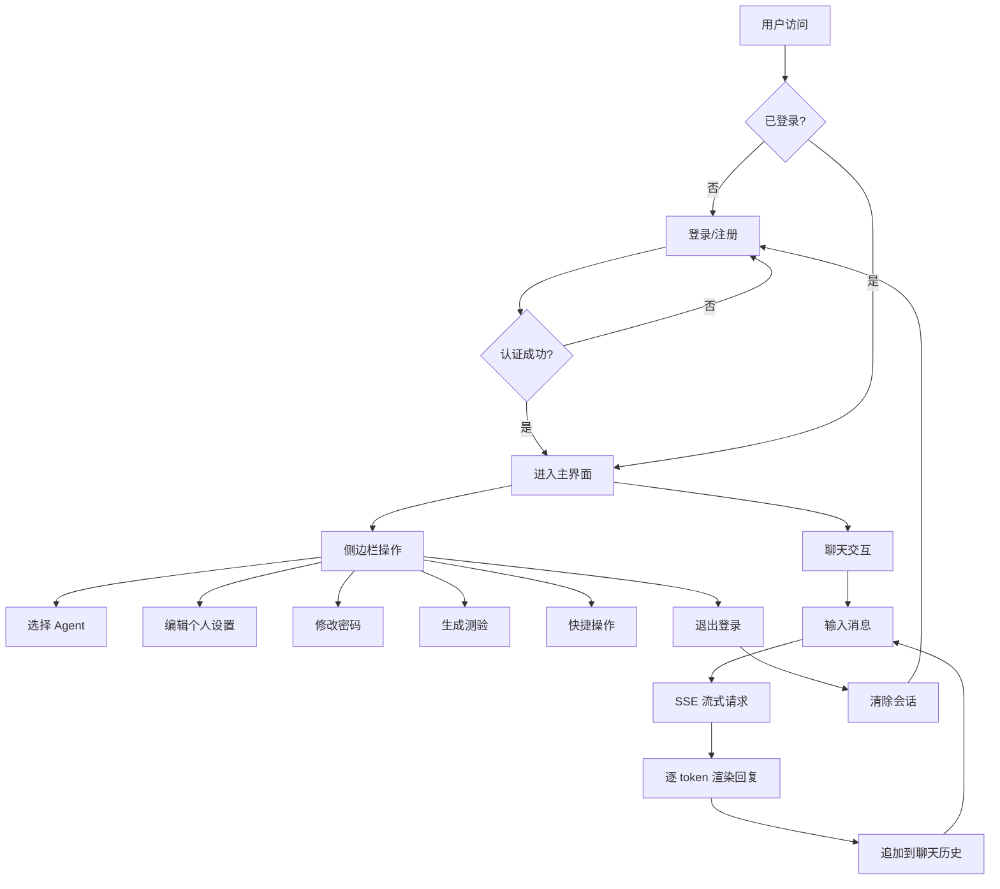

# 学习辅助系统 — 前端重构 PRD

## 1. 产品概述

将现有 Streamlit 学习辅助系统的前端使用 HTML、CSS 和 JavaScript 完全重构，实现功能一致、性能更优、可独立部署的纯前端应用。系统为学习者提供 AI 驱动的学习规划、资料推荐、答疑解惑和测验生成等智能服务。

- 目标用户：希望借助 AI 提升学习效率的学生和自学者
- 核心价值：通过多 Agent 协作（规划师、专家、伙伴、出题官等）提供个性化学习辅助

## 2. 核心功能

### 2.1 用户角色

| 角色 | 注册方式 | 核心权限 |
|------|---------|---------|
| 普通用户 | 用户名+密码注册 | 使用全部学习辅助功能 |

### 2.2 功能模块

1. **认证模块**：登录、注册、退出登录、修改密码
2. **聊天交互模块**：SSE 流式对话、消息历史、多 Agent 切换、快捷操作
3. **个人设置模块**：昵称/邮箱/水平/领域/时间/偏好编辑
4. **Agent 选择器**：手动选择特定 Agent 或自动识别
5. **测验生成器**：指定知识点和题目数，一键生成测验

### 2.3 页面详情

| 页面名称 | 模块名称 | 功能描述 |
|---------|---------|---------|
| 登录页 | 登录/注册表单 | Tab 切换登录/注册；表单校验；登录成功后跳转主界面 |
| 主界面 - 侧边栏 | 用户信息 | 展示昵称和用户名 |
| 主界面 - 侧边栏 | 个人设置 | 折叠面板；编辑昵称/邮箱/学习水平/目标领域/可用时间/偏好；刷新信息；保存设置 |
| 主界面 - 侧边栏 | 修改密码 | 折叠面板；原密码+新密码+确认新密码；前端校验+API提交 |
| 主界面 - 侧边栏 | Agent 选择器 | 单选按钮组；选择 planner/expert/partner/quizzer/reviewer/examiner 或自动识别 |
| 主界面 - 侧边栏 | 快捷操作 | 一键生成学习计划按钮；退出登录（含确认对话框） |
| 主界面 - 侧边栏 | 测验生成 | 折叠面板；输入知识点+选择题目数量+生成按钮 |
| 主界面 - 聊天区 | 聊天历史 | 渲染全部历史消息；用户/助手区分；显示处理消息的 Agent 标签；空态引导 |
| 主界面 - 聊天区 | 流式对话 | 输入框发送消息；SSE 逐 token 渲染；光标动画；"正在等待..."提示；错误/超时处理 |

## 3. 核心流程

## 4. 用户界面设计

### 4.1 设计风格

- **主题**：安静、专注的学术学习风格，采用暖灰基调
- **主色**：`#4a5a7f`（蓝灰，代表专注与可信赖）
- **辅助色**：`#5d6e99`（hover 态）
- **背景色**：`#f8f7f5`（浅暖灰页面底色）、`#f2f1ee`（卡片底色）
- **文字色**：`#2d2c2a`（主文字）、`#6e6c68`（次要文字）
- **边框色**：`#e2e0db`
- **阴影**：`0 4px 24px rgba(0,0,0,0.08)`
- **暗色模式**：完整支持 `prefers-color-scheme: dark`
- **字体**：使用系统原生中文字体（PingFang SC / Microsoft YaHei），搭配 Geist 等现代西文字体
- **布局**：左侧边栏(280px) + 右侧聊天主区域(flex)；桌面优先，移动端侧边栏折叠
- **按钮**：圆角 8px，最小高度 44px，含 hover 过渡
- **图标**：使用 emoji 作为角色头像(👤🤖⚠️)

### 4.2 页面设计概述

| 页面名称 | 模块名称 | UI 元素 |
|---------|---------|---------|
| 登录页 | 居中卡片 | 最大宽度 420px；圆角 12px；阴影卡片；标题居中；Tab 切换登录/注册 |
| 主界面 - 侧边栏 | 用户信息区 | 顶部展示昵称(标题级)+用户名(次要文字) |
| 主界面 - 侧边栏 | 折叠面板 | `
/
` 实现；带有 emoji 图标标题 |
| 主界面 - 侧边栏 | Agent 选择器 | 单选按钮列表；默认选中"自动识别" |
| 主界面 - 侧边栏 | 快捷操作 | 两个并排按钮(计划+退出)；确认退出弹窗 |
| 主界面 - 聊天区 | 空态 | 居中文本+emoji；展示功能介绍 |
| 主界面 - 聊天区 | 消息气泡 | 用户消息右对齐/助手消息左对齐；区分角色显示；Agent 标签caption |
| 主界面 - 聊天区 | 输入框 | 底部固定；圆角；placeholder 提示文字；Enter 发送 |

### 4.3 响应式设计

- **桌面端(>768px)**：侧边栏固定 280px，聊天区自适应剩余宽度
- **平板/移动端(≤768px)**：侧边栏默认隐藏，通过汉堡菜单展开为抽屉；聊天区占满全宽；登录卡片取消固定宽度

## 5. 非功能需求

- 流式输出延迟 ≤100ms（随 token 到达即时更新 DOM）
- 页面首次加载 ≤2s（纯静态资源）
- 支持 Chrome/Firefox/Safari/Edge 最新两个大版本
- 符合 WCAG 2.1 AA 可访问性标准（语义化 HTML、skip link、ARIA 标签、键盘导航）
- Token 存储于 localStorage，敏感操作需 Bearer 认证