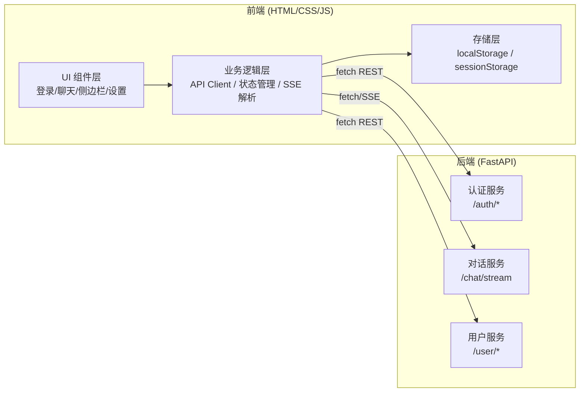
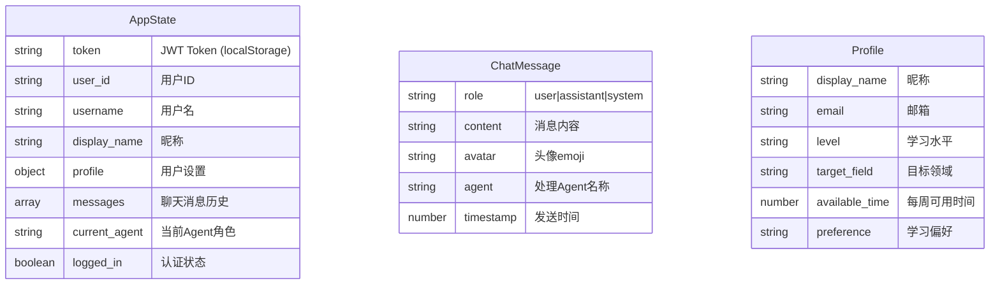

# 学习辅助系统 — 技术架构文档

## 1. 架构设计



纯前端架构：HTML/CSS/JS 静态文件 + 后端 FastAPI 服务。无构建工具，无框架依赖（除 Markdown 解析库 `marked.js`）。

## 2. 技术选型

| 层级 | 技术 | 说明 |
|------|------|------|
| 标记语言 | HTML5 | 语义化标签，`<details>` 折叠面板，`<template>` 模板 |
| 样式 | CSS3 | 自定义属性(CSS Variables)、Grid/Flexbox、媒体查询、动画 |
| 脚本 | ES2020 JavaScript | 原生 `fetch()`、`ReadableStream`、`AbortController`、模块化 IIFE |
| Markdown | marked.js (CDN) | 仅用于聊天消息 Markdown 渲染，约 20KB gzipped |
| 后端 | FastAPI (已有) | 保持不变，仅前端重构 |

## 3. 项目结构

```
frontend/
├── index.html          # 主入口，SPA 单页面
├── css/
│   ├── variables.css   # CSS 自定义属性(色彩/字体/间距/阴影)
│   ├── base.css        # 全局重置、排版、按钮样式
│   ├── layout.css      # 页面布局(侧边栏+主区域 Grid)
│   ├── auth.css        # 登录/注册卡片样式
│   ├── chat.css        # 聊天消息、流式输出、输入框样式
│   ├── sidebar.css     # 侧边栏组件样式
│   └── responsive.css  # 媒体查询、暗色模式
├── js/
│   ├── app.js          # 应用入口，初始化、路由、全局状态
│   ├── api.js          # API 客户端(fetch 封装、认证、错误处理)
│   ├── sse.js          # SSE 流式请求(ReadableStream 解析、重连)
│   ├── auth.js         # 登录/注册/退出逻辑
│   ├── chat.js         # 聊天交互(发送/渲染/流式更新/滚动)
│   ├── sidebar.js      # 侧边栏(设置/密码/Agent/测验)
│   ├── state.js        # 状态管理(Token、消息历史、设置)
│   └── utils.js        # 工具函数(校验、格式化、DOM 操作)
└── tests/
    ├── api.test.js     # API 客户端测试
    ├── sse.test.js     # SSE 解析测试
    ├── auth.test.js    # 认证逻辑测试
    ├── chat.test.js    # 聊天功能测试
    └── state.test.js   # 状态管理测试
```

## 4. 路由定义

| 路由 | 用途 |
|------|------|
| `#login` | 登录/注册页面（默认路由，未认证时显示） |
| `#chat` | 聊天主界面（认证后默认路由） |

使用 hash 路由，通过 `window.onhashchange` 切换视图，无需服务端配置。

## 5. API 接口定义

### 5.1 认证接口

```typescript
// POST /auth/login
interface LoginRequest {
  username: string;
  password: string;
}
interface LoginResponse {
  token: string;
  user_id: string;
  username: string;
  display_name: string;
}

// POST /auth/register
interface RegisterRequest {
  username: string;
  password: string;
  display_name?: string;
  email?: string;
}

// POST /auth/logout
// (无请求体)
```

### 5.2 用户接口

```typescript
// GET /user/profile
interface ProfileResponse {
  display_name: string;
  email: string;
  level: string;
  target_field: string;
  available_time: number;
  preference: string;
}

// PUT /user/profile
interface UpdateProfileRequest {
  display_name?: string;
  email?: string;
  level?: string;
  target_field?: string;
  available_time?: number;
  preference?: string;
}

// PUT /user/profile/password
interface ChangePasswordRequest {
  old_password: string;
  new_password: string;
}
```

### 5.3 对话接口（SSE 流式）

```typescript
// POST /chat/stream
interface ChatStreamRequest {
  message: string;
  user_id: string;
  history: Array<{ role: string; content: string }>;
  agent_role?: string;
  system_prompt?: string;
}

// SSE 事件类型
type SSEEvent =
  | { type: "start"; agent_role: string }
  | { type: "chunk"; content: string }
  | { type: "done" }
  | { type: "error"; content: string };
```

## 6. 数据模型

### 6.1 前端状态模型



### 6.2 存储策略

| 数据 | 存储位置 | 持久性 |
|------|---------|--------|
| Token | `localStorage` | 跨会话 |
| user_id | `localStorage` | 跨会话 |
| username/display_name | `localStorage` | 跨会话 |
| 消息历史 | `sessionStorage` | 标签页会话 |
| current_agent | `sessionStorage` | 标签页会话 |
| profile | `sessionStorage` | 标签页会话 |
| UI 状态(展开/折叠) | 内存 | 页面级别 |

## 7. 组件树

```
App
├── LoginPage (hash=#login 或未认证)
│   ├── LoginCard
│   │   ├── TabBar (登录/注册)
│   │   ├── LoginForm (用户名 + 密码 + 按钮)
│   │   └── RegisterForm (用户名 + 昵称 + 邮箱 + 密码 + 确认密码 + 按钮)
│   └── Toast (错误/成功提示)
│
└── MainPage (hash=#chat 且已认证)
    ├── Sidebar
    │   ├── UserInfo (昵称 + 用户名)
    │   ├── SettingsPanel (<details>)
    │   │   ├── RefreshButton
    │   │   ├── FormFields (昵称/邮箱/水平/领域/时间/偏好)
    │   │   └── SaveButton
    │   ├── PasswordPanel (<details>)
    │   │   ├── PasswordFields (原密码+新密码+确认)
    │   │   └── SubmitButton
    │   ├── AgentSelector (radio 按钮组)
    │   ├── QuickActions (计划按钮 + 退出按钮)
    │   ├── LogoutConfirm (确认弹窗)
    │   └── QuizPanel (<details>)
    │       ├── TopicInput + CountSlider + GenerateButton
    │       └── ConfirmModal
    └── ChatArea
        ├── SkipLink (无障碍跳转)
        ├── TitleBar (标题)
        ├── MessageList
        │   ├── EmptyState (空态引导)
        │   └── MessageBubble[] (消息气泡)
        │       ├── Avatar
        │       ├── Content (Markdown 渲染)
        │       └── AgentLabel (处理Agent)
        └── ChatInput
            ├── TextArea / Input
            └── SendButton
```

## 8. 关键实现要点

### 8.1 SSE 流式处理

```javascript
// fetch() + ReadableStream 实现 POST SSE
async function* streamChat(payload) {
  const res = await fetch(`${API_BASE}/chat/stream`, {
    method: "POST",
    headers: { "Content-Type": "application/json", Authorization: `Bearer ${token}` },
    body: JSON.stringify(payload),
  });
  const reader = res.body.getReader();
  const decoder = new TextDecoder();
  let buffer = "";
  while (true) {
    const { done, value } = await reader.read();
    if (done) break;
    buffer += decoder.decode(value, { stream: true });
    // 按 \n\n 分割 SSE 事件
    const parts = buffer.split("\n\n");
    buffer = parts.pop();
    for (const part of parts) {
      const line = part.startsWith("data: ") ? part.slice(6) : part;
      try { yield JSON.parse(line); } catch {}
    }
  }
}
```

### 8.2 Token 管理

- 登录后存入 `localStorage`
- 每次 API 请求自动附加 `Authorization: Bearer` 头
- 退出登录清除 `localStorage` 和 `sessionStorage`

### 8.3 性能优化

- CSS/JS 文件按需加载(link/script 标签)
- 消息列表使用 DocumentFragment 批量插入
- 流式内容使用 `textContent` 直接赋值（避免 innerHTML 性能开销）
- Markdown 渲染仅在消息完成后执行一次
- 消息列表超过 50 条自动截断旧消息

### 8.4 安全措施

- Token 不存于 Cookie（防 CSRF）
- 所有输入做 XSS 过滤（DOMPurify 或手动转义）
- fetch 凭证不发送跨域 Cookie
- 密码字段设置 `autocomplete="off"`